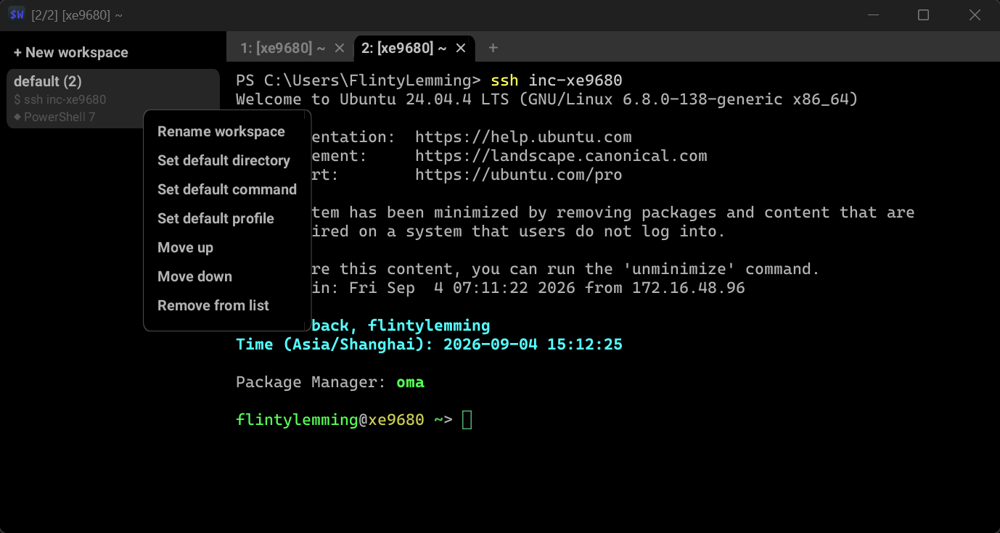

# Sideterm

[English](README.md)

**Sideterm** 是 [WezTerm](https://github.com/wezterm/wezterm) 的分支（fork）。WezTerm 是一个用 Rust 编写的 GPU 加速跨平台终端模拟器与复用器。Sideterm 在此基础上加入了一个核心功能：**工作区侧边栏，把终端从「一堆标签页」变成「工作区 → 标签页」的两级结构**，灵感来自 [Taxis](https://github.com/mufeedali/taxis)（Ptyxis 的分支）。

上游 WezTerm 能做的，Sideterm 都能做；你现有的 `wezterm.lua` 配置无需修改即可使用。本 README 只记录 **Sideterm 相对上游新增的内容**，其余功能请参考上游文档 <https://wezterm.org/>。



## 与上游 WezTerm 的区别

### 1. 工作区侧边栏

侧边栏占据窗口整个左边缘（标签栏位于其右侧），列出所有工作区：

- **合并列表**：配置中声明的工作区 + mux 中实际存活的工作区。配置了但尚未打开的显示为灰色；已打开的显示标签数徽标，如有配置还会显示 cwd / 命令副标题。
- **左键点击**：切换到该工作区（`SwitchToWorkspace`）；若尚未打开，则创建它并生成第一个标签，同时应用配置的 cwd 和默认命令。
- **右键点击**：弹出浮动上下文菜单（用原生 GUI 元素渲染，而非终端 overlay）：
  - 重命名工作区（Rename workspace）
  - 设置默认目录（Set default directory）
  - 设置默认命令（Set default command）
  - 上移 / 下移（调整侧边栏顺序，仅保存在内存中）
  - 从列表移除（仅隐藏该条目，不会杀死工作区）
- **顶部 ＋ 按钮**：输入名称新建工作区。
- 通过菜单做的修改（cwd / 命令 / 顺序）都是**只存内存的运行时覆盖**，不会写回 Lua 配置文件。生效优先级：运行时覆盖 > `workspaces` 配置 > 未设置。

### 2. 每个工作区的默认 cwd 和默认命令

每个工作区可以携带默认值，作用于**该工作区内每个新生成的标签**：

- **默认 cwd**：作为生成标签时的兜底，优先级为：显式指定 > OSC7 继承 > 工作区默认 > 系统默认。
- **默认命令**：以「向 shell 注入输入文本」的方式执行（不是 exec 替换）：标签正常启动 shell，等 shell 产生首次输出后再把命令打进去。命令退出后回到 shell 提示符，标签不会关闭。注入只对新生成的标签执行一次；respawn、会话恢复的标签不会重放；程序启动时的第一个标签也不注入。

### 3. GUI 渲染的菜单与对话框

侧边栏的右键菜单、重命名输入框和编辑对话框均使用 box-model GUI 元素系统绘制（与 fancy 标签栏同源），带悬停态、圆角和边框，而不是复用终端单元格 overlay。

### 4. 更名与打包

- 用户可见名称改为 **Sideterm**（窗口标题、菜单、关于/退出项、更新提示）。二进制文件名、crate 名、配置文件路径、`WEZTERM_*` 环境变量、Lua 模块名和 Windows AppUserModelID **均未改变**，现有配置继续可用，也方便合并上游更新。
- 提供 Windows Inno Setup 安装包（`Sideterm-<ver>-setup.exe`），使用独立的 AppId，可与 WezTerm **共存安装**。通过手动触发的 GitHub Actions 工作流构建。

## 新增配置

所有新选项都写在常规的 `wezterm.lua` 里。全部可选；未指定的颜色会从终端前景/背景色推导，让侧边栏与终端视觉融为一体。

### `workspaces`（新配置段）

声明要在侧边栏显示的工作区，可附带每工作区默认值：

```lua
return {
  workspaces = {
    { name = "api",     cwd = "D:/code/api", default_command = "npm run dev" },
    { name = "wezterm", cwd = "C:/Users/you/Projects/wezterm" },
  },
}
```

| 字段 | 类型 | 说明 |
|---|---|---|
| `name` | string（必填） | 工作区名，需与 mux 工作区名一致 |
| `cwd` | path（可选） | 该工作区新标签的默认工作目录 |
| `default_command` | string（可选） | 注入到新标签 shell 中的文本；为空或纯空格视为未设置 |

名称为空的条目会被忽略并给出警告；重名条目以先出现的为准。

### 侧边栏选项

| 选项 | 类型 | 默认值 | 说明 |
|---|---|---|---|
| `enable_sidebar` | bool | `true` ⚠️ | 是否显示工作区侧边栏。**与最初设计不同：Sideterm 默认开启**，方便发现功能；上游 WezTerm 本身没有侧边栏 |
| `sidebar_width` | usize（单元格数） | `24` | 侧边栏宽度，以终端单元格计 |
| `sidebar_hide_when_narrow` | bool | `true` | 窗口过窄时自动隐藏侧边栏 |

### `colors.sidebar`（新配色段）

```lua
return {
  colors = {
    sidebar = {
      background = "#202020",           -- 侧边栏背景（默认取终端背景色）
      foreground = "#ffffff",           -- 条目文字（默认取终端前景色）
      inactive_foreground = "#808080",  -- 未打开工作区的文字颜色
      subtitle_foreground = "#a0a0a0",  -- cwd / 命令副标题颜色
      active = { bg_color = "#303030", fg_color = "#ffffff" }, -- 当前工作区行
      hover  = { bg_color = "#2a2a2a", fg_color = "#ffffff" }, -- 鼠标悬停行
      active_indicator = "#5294e2",     -- 当前行左边缘指示条颜色
      menu_border = "#404040",          -- 右键菜单边框颜色
    },
  },
}
```

`active` 和 `hover` 接受与标签栏配色条目相同的 `{ bg_color, fg_color, ... }` 结构。未指定的项会从终端配色推导。

### 新按键动作：`ToggleSidebar`

`ToggleSidebar` 按窗口显示/隐藏侧边栏。**默认不绑定任何按键**，按 WezTerm 惯例请自行绑定：

```lua
local wezterm = require 'wezterm'
return {
  keys = {
    { key = 'b', mods = 'CTRL|SHIFT', action = wezterm.action.ToggleSidebar },
  },
}
```

## 兼容性与上游同步

- `main` 分支承载 Sideterm 的改动；`upstream` 分支跟踪上游 WezTerm，并定期合并回来。
- mux 现有的工作区持久化、会话恢复以及其他所有 WezTerm 功能均未改动。

## 安装

从 [Releases](https://github.com/FlintyLemming/sideterm/releases) 页面下载 `Sideterm-<ver>-setup.exe`（安装包，可与 WezTerm 共存）或绿色版 `Sideterm-windows-<ver>.zip`。其他平台请按[上游编译说明](https://wezterm.org/install/source.html)从源码构建。

## 致谢

终端本身的全部功劳属于 [Wez Furlong](https://github.com/wez) 和 WezTerm 的贡献者们。Sideterm 只加上了上述的工作区侧边栏与打包。如果 WezTerm 对你有用，欢迎[赞助上游项目](https://wezterm.org/sponsor.html)。
